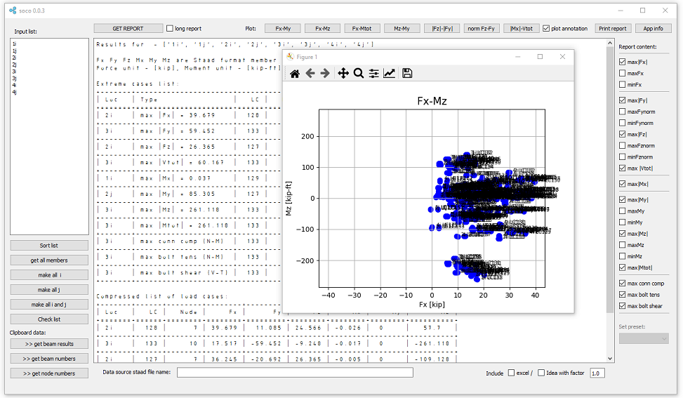

Soco - Staad member result extract tool
---------------------------------------

`Download binaries for Windows <https://github.com/lukaszlaba/soco/releases>`_

Changelog
---------

Soco 0.2.1 (beta stage) wip
  - Fxy Fxz Fxyz check added

Soco 0.1.0 (beta stage)
  - ui update

Soco 0.0.4 (beta stage)
  - IdeaStatica output update
  - show selected members and nodes in staad
  - cheking if clipboard data is corect
  - preset report content
  - plot axis proportion fixed

Soco 0.0.3 (alpha stage)
  - IdeaStatica output (need tests)
  - excel format output
  - short list of critical LC
  - selecting content of report
  - absFx, Mymax, Mymin, Mzmax, Mzmin added
  - Fznorm Fynorm and plot for that added
  - code refactoring
  - plot Mx-Vtot changed in to absMx-Vtot
  - plot orientation update
  - plot Mx-Vtot change in to absMx-Vtot
  - plot Fx-Fy change in to absFx-absFy

Soco 0.0.2 (alpha stage for testing)
  - unit autodetection
  - LC data added for plots
  - Max conn comp, Max bolt tens, Max bolt shear update

Soco 0.0.1 (alpha stage for testing)
  - first public release

Description
-----------

Soco is a tool that help analyse Staad member results. Soco output report and plots make easy to find extreme member forces needed for connection design.

How to run it
-------------

Windows binaries available. Just download it and run exe file.
Link to windows binaries download is shown below.

https://github.com/lukaszlaba/soco/releases

You can also run soco by using Python engine. After the Python and needed libraries are installed, just run soco.py file. Soco is based on Python 3 and no\n-standard Python libraries PyQt5, matplotlib, tabulate and pywin32.

License
-------

Copyright (C) 2022-2025 Łukasz Laba <lukaszlaba@gmail.com>

Soco is free software; you can redistribute it and/or modify
it under the terms of the GNU General Public License as published by
the Free Software Foundation; either version 2 of the License, or
(at your option) any later version.

Soco is distributed in the hope that it will be useful,
but WITHOUT ANY WARRANTY; without even the implied warranty of
MERCHANTABILITY or FITNESS FOR A PARTICULAR PURPOSE.  See the
GNU General Public License for more details.